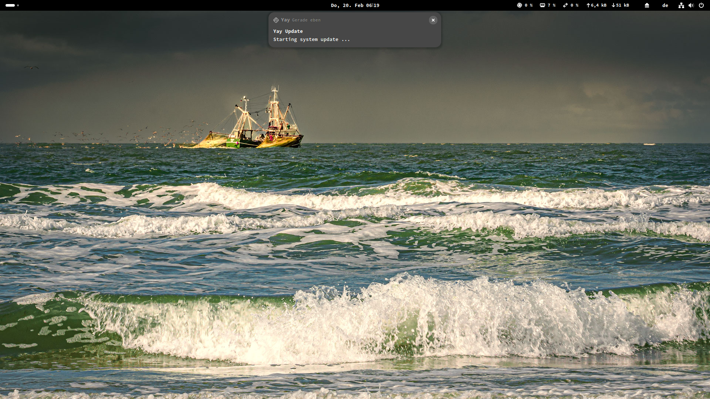
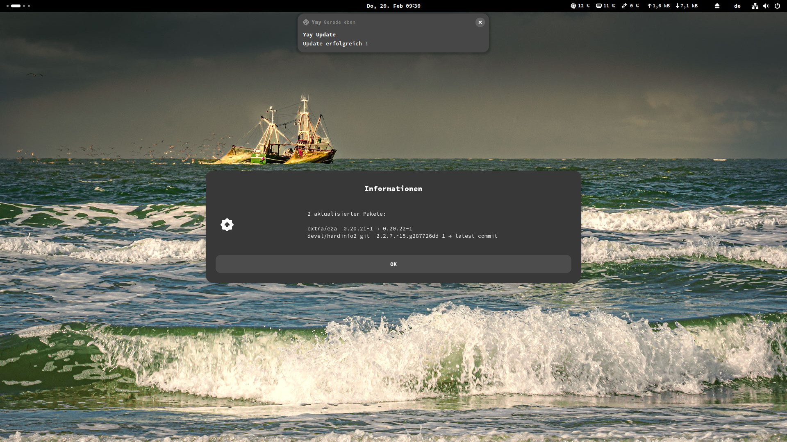
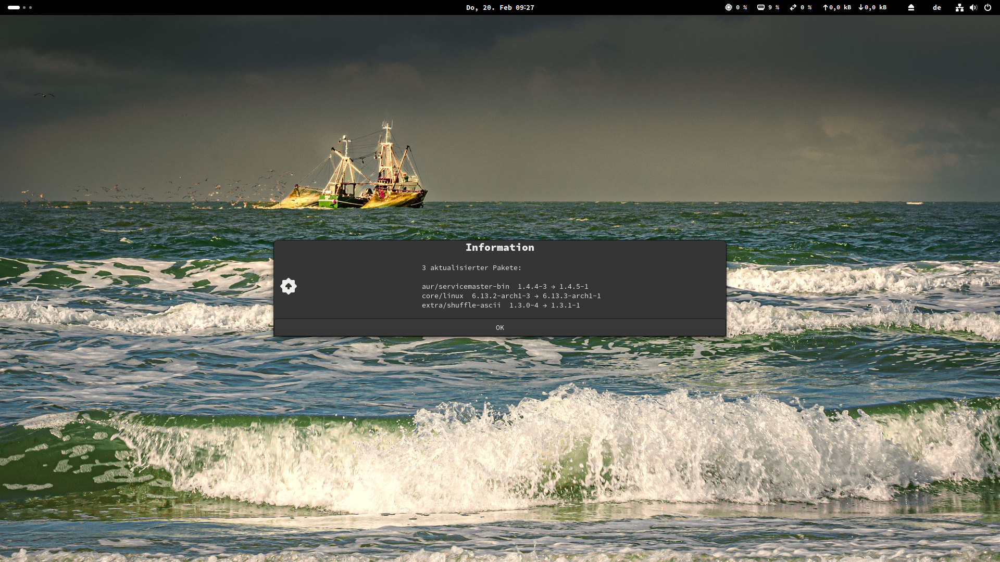
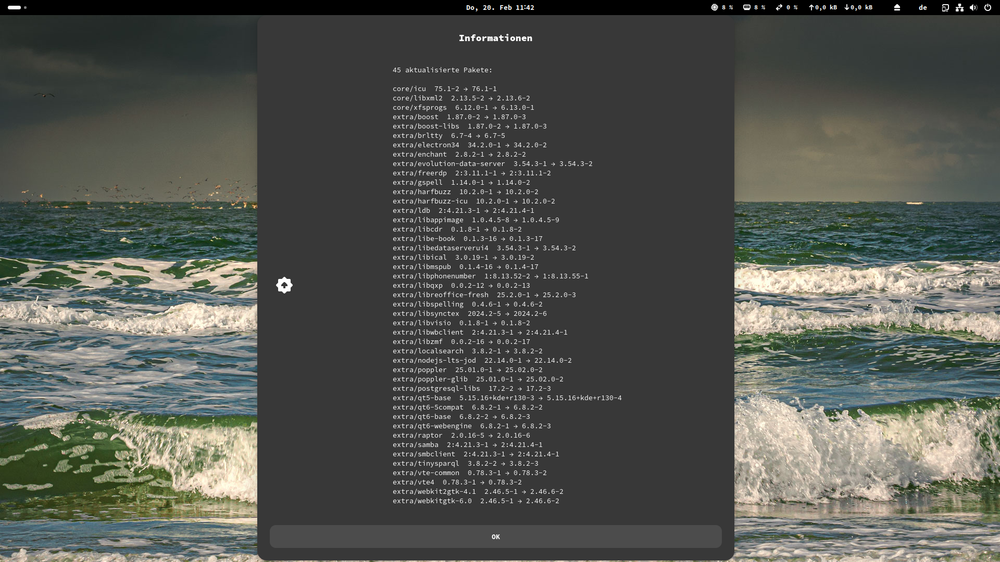

# Yay-autoupdate v1.1
**This is more for the advanced Archlinux user! Maybe you need to do a little more work to make sure everything works on your system too. I only tested it on mine so far and it works very well.**

Archlinux Yay automatic update Systemd service. The Systemd service "yay-update.service" is configured for Gnome / Wayland, but it can easily be configured for other systems as well.
When notifications popup, you will hear different sounds (soundcard). The system update starts with a low beep from the speaker, error notifications popup with a high beep.
In case of available updates, a list of all the updated packages with version informations will appear in a Zenity - info dialog at the center of your screen.
After an update the pacman and yay cache will be cleaned and logrotate is performed on pacman's log file ( Otherwise it gets very large after some time).
Detailed information about the update, cleanup and logrotate process is in the log file /tmp/yay-update.log.

**If you have problems with permissions, the only option is to configure sudo passwordless. This represents a certain security risk and should be carefully considered.
I just use my PC alone and I know what I'm doing. I've never had any problems without a sudo password.**
Make sudo passwordless:
```bash
sudo visudo
```
Add this after the last line (with your username):
```bash
lennart ALL=(ALL) NOPASSWD: ALL
```

## Requirements:
The following packages need to be installed:
"zenity", "libnotify", "logrotate" and "beep".
If you don't have them installed, the install script notices it and will ask you whether you want to install the missing packages now.
**Is the output from yay in english ? Then you don't have to change anything. If not, then translate the string "there is nothing to do" in yay-update.sh line 33 to your yay's output language first !**
```bash
yay -S zenity libnotify beep logrotate
```

## Installation:

``` bash
./install.sh
```

Leave a star if you like this good work, that always makes me happy :-)

## Screenshots (Gnome / Wayland):

Starting system update... - notification after boot:

System is uptodate ! (It's German language on the screenshots, on GitHub it's all in English):

Update succesful and 2 packages were updated: - notification and Zenity info dialog

3 packages were updated - shown with Zenity info dialog

And finally 45 updates:


2025 Lennart Martens
